# Install VMWare Workstation Player and Kali Linux  Setup

---

Hello guys! This is tutorial to setup kali linux in your host(laptop) without uninstalling your windows. 

---

### 1. Download WinRAR at the following site based on your Windows version (32-bit or 64-bit) and install WinRAR program.

WinRAR Link : [WinRAR](https://www.win-rar.com/download.html?&L=0)

---

### 2. Download Kali Linux Image

Kali Linux Link : [Get Kali | Kali Linux](https://www.kali.org/get-kali/#kali-virtual-machines)

*Make sure you download the one that already pre built for VMware (refer photos below 👇🏿)*

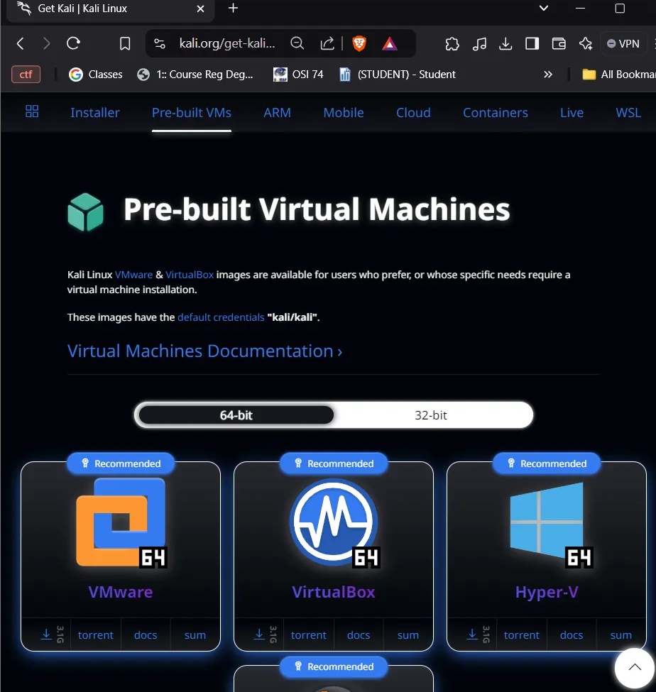

Download the VMware one, just click the download (arrow) symbol

---

### 3. Go to the Download Folder (C:\Users\UserName\Downloads)

*Make the Kali folder at the C:\*  

*Move the file (kali-linux-2024.3-vmware-amd64) to the C:\Kali*   

  

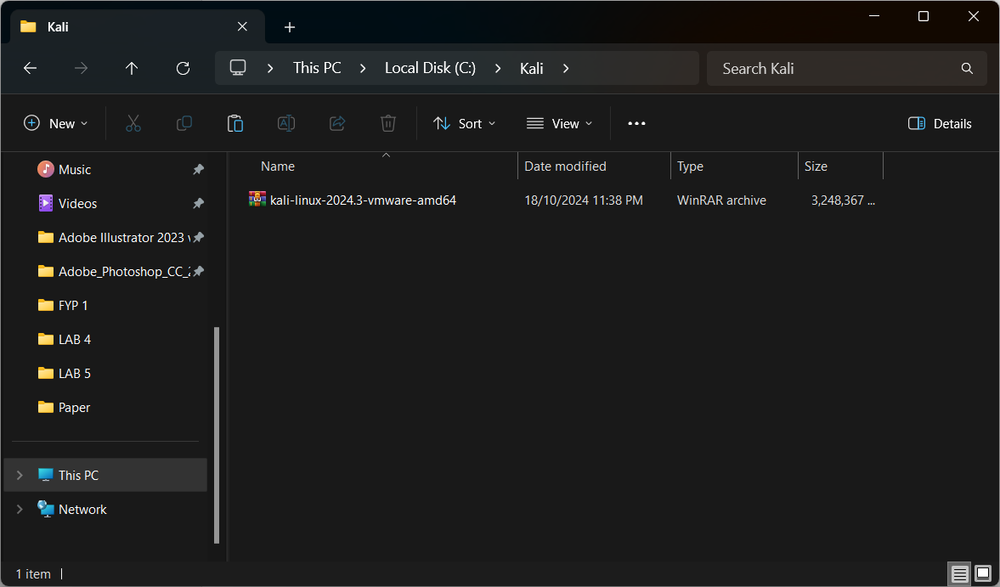

*Click the file with Mouse right, and then select WinRAR > Extract to “kali-linux”.* 

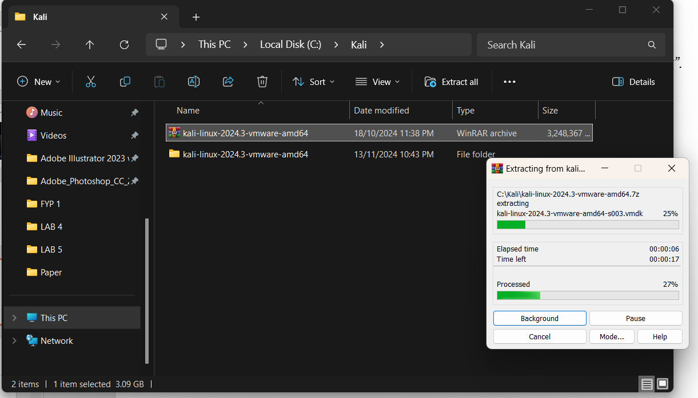

---

### 4. Download VMware Workstation. First, visit the following Google Drive link

Google Drive Link : [VMware Workstation](https://drive.google.com/file/d/1grjM81qPywO2Y-4CprIyU1H3xscb7Ph6/view?usp=drive_link)

*Download -> New tab will appear -> Download anyway*   

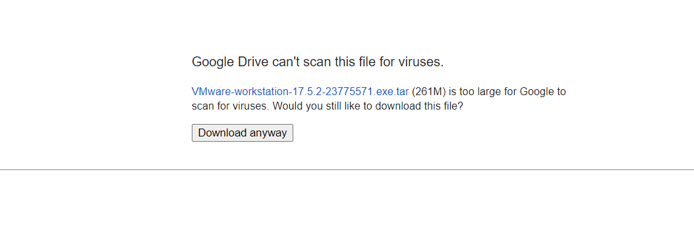

---

### 5. Install VMWare Workstation Player

*Extract The Downloaded VMWare File & Install  Right click > WinRAR > Extract to “ VMware-workstation”* 

  **

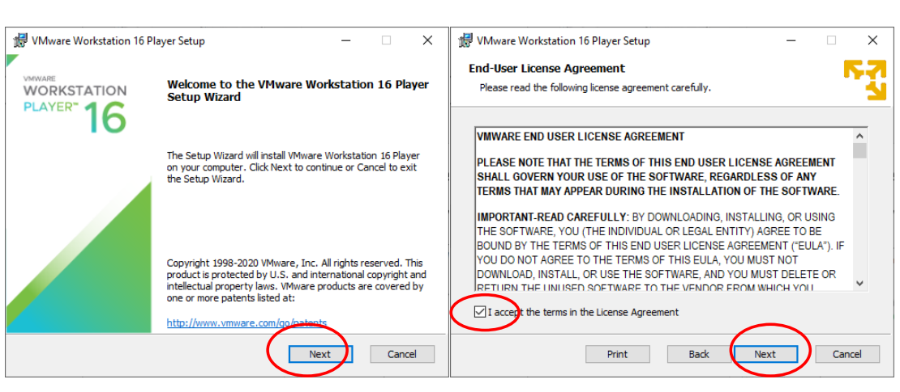

*Click "Next," tick the small checkbox, and click "Next" again.*

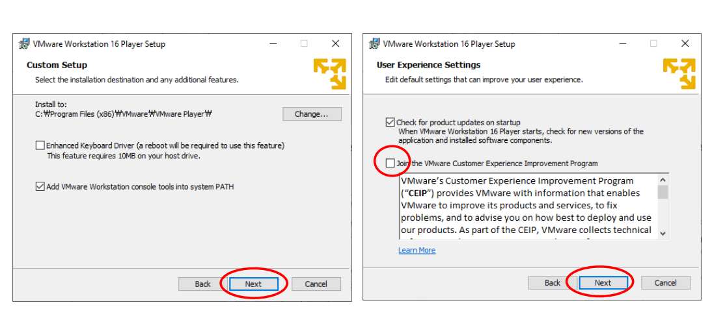

*Tick the small checkbox, “Enhanced Keyboard Driver” and “Add WMware Workstation console” then click "Next" again.*

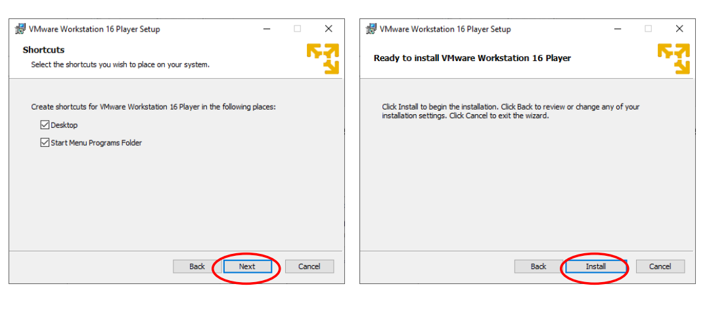

*Click "Next," , and click "Install".*

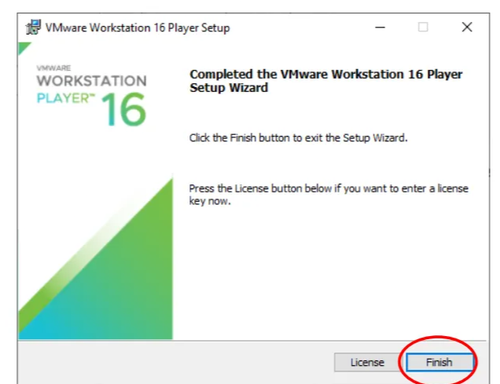

*Click "Finish".*

---

### 6. Finish installing and setup the VMware

*Click the VMware installer and just download as always. If it asking you to update you can ignore it first.* 

*If you finish the VMware setup you should see this screen if VMware is open*

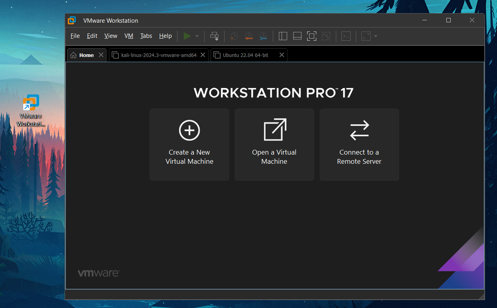

---

### 7. Import and Run Kali Linux VMWare vmdk file into the VMWare Workstation Player

*Click Open a Virtual Machine > Open, then select the following file “C:\Kali\kali-linux-2024.3-vmware-amd64\kali-linux-2024.3-vmware-amd64.vmwarevm”* 

 

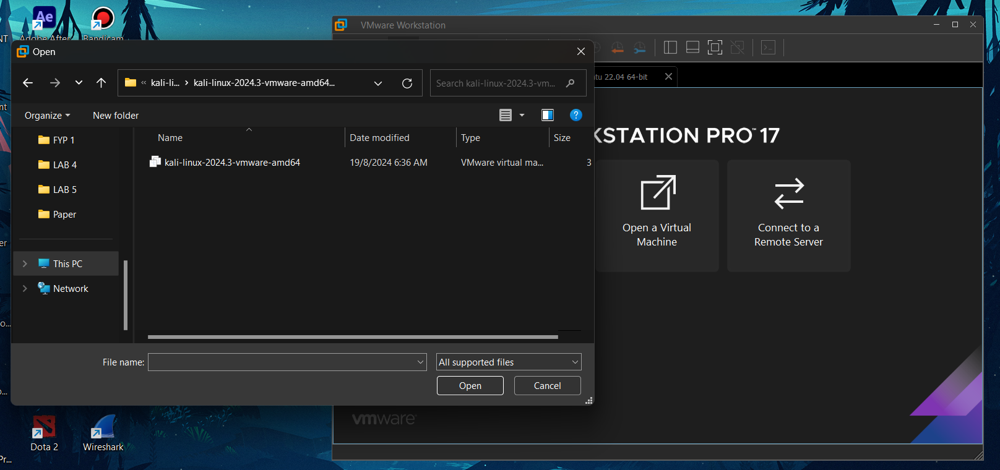

*It will take some time to boot the kali inside the vmware. Just wait until its done. If the boot is done, you will see this screen.*

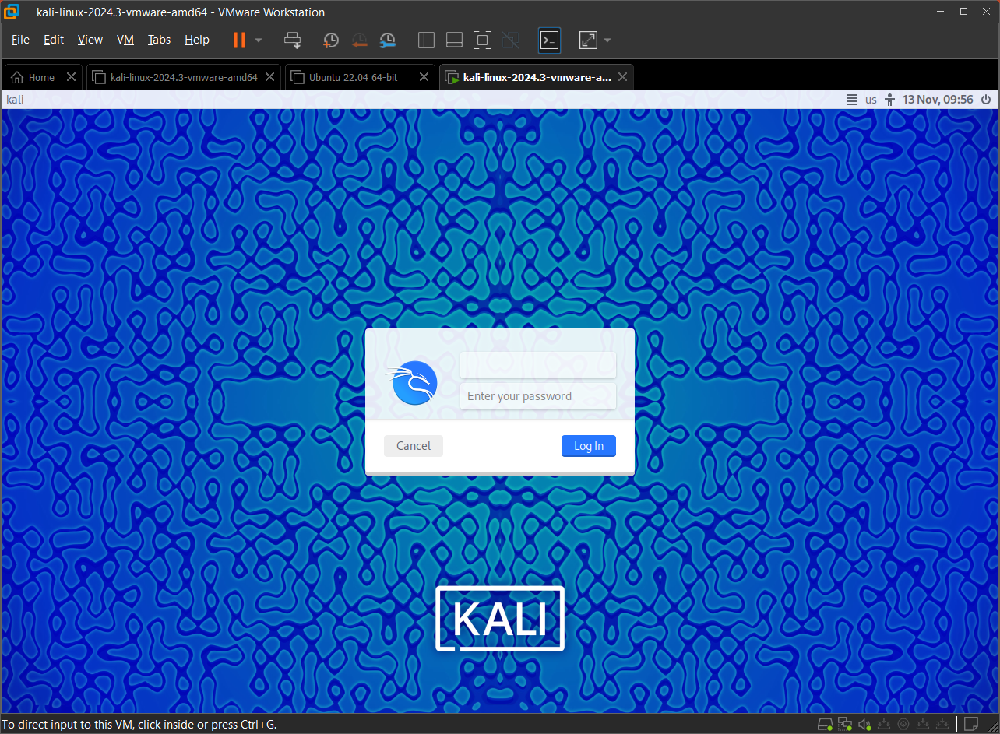

*You can login using this credential :*

*Username : kali*

*Password : kali*

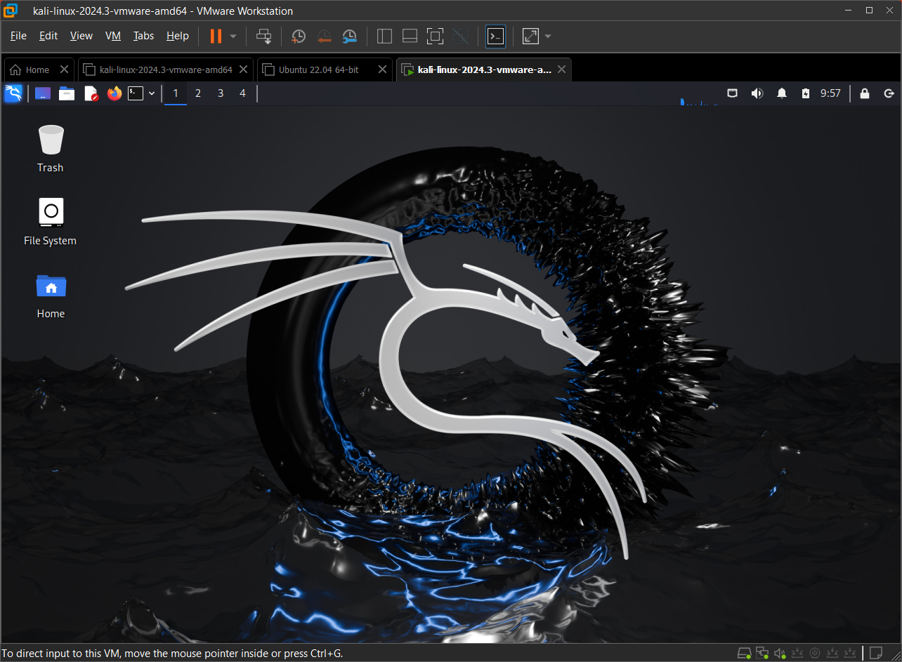

*Congratulation mate!* 

---

Thats all! If you have any question do tell in the whatsapp yaaa, thank you!😍